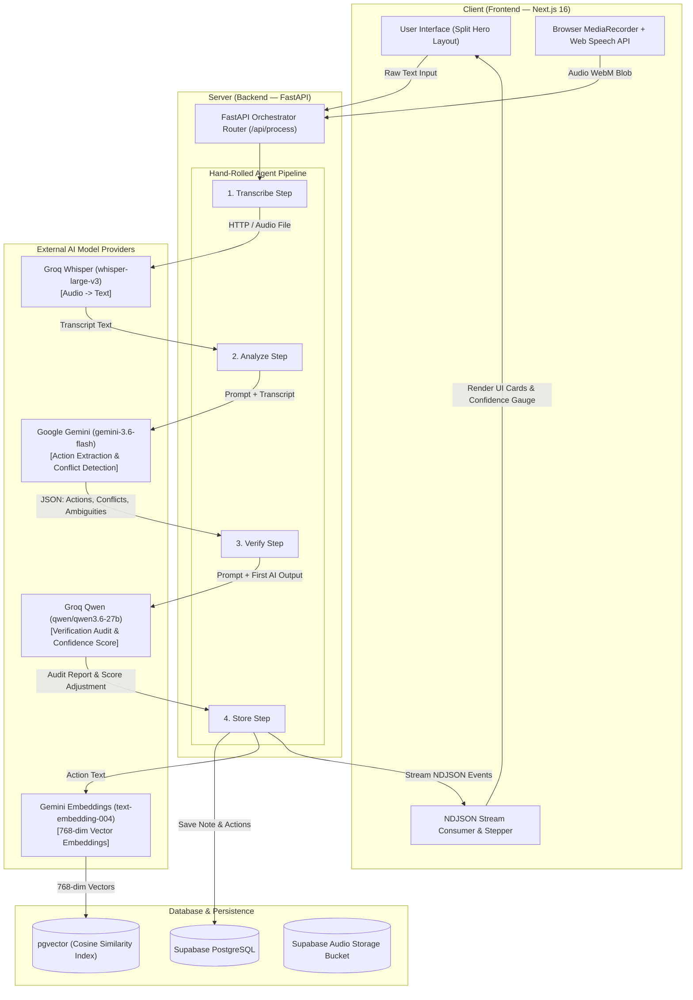

# 📐 System Architecture — VoiceActions AI

> *Every box, arrow, model call, and data store labelled.*

---

---

## 🔍 Layer-by-Layer Data Flow

### 1. Input Layer (Client)
- **Voice Mode:** Captures WebM audio via `navigator.mediaDevices.getUserMedia()`. On-device **Web Speech API** provides real-time speech preview.
- **Text & Document Mode:** Accepts raw meeting notes or text files directly.

### 2. Orchestration Layer (FastAPI Backend)
- Hand-rolled asynchronous agent loop (NO LangChain overhead).
- Manages **retries** (exponential backoff), **fallback chains** (Gemini ↔ Groq), and **decision trace logging**.
- Streams step-by-step progress to the frontend using `application/x-ndjson`.

### 3. Model Pipeline (Two-Model Cooperation)
- **Step 1 — Transcribe:** `Groq Whisper-large-v3` transcribes audio (handles Hindi-English code mixing).
- **Step 2 — Analyze:** `Google Gemini 3.6 Flash` extracts structured action items, severe conflicts, and missing details (ambiguities).
- **Step 3 — Verify Audit:** `Groq Qwen 27B` audits Gemini's output for false conflicts or missed items and adjusts final confidence.

### 4. Data & Retrieval Layer (Supabase + pgvector)
- **PostgreSQL Database:** Stores voice notes, structured action cards, and conflict logs.
- **pgvector:** Stores 768-dimensional embeddings generated by `text-embedding-004` for semantic search over past team actions.
