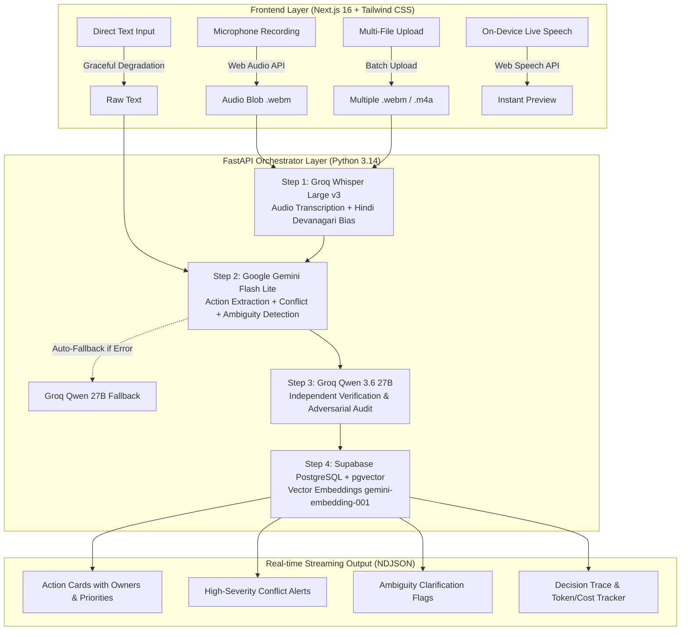
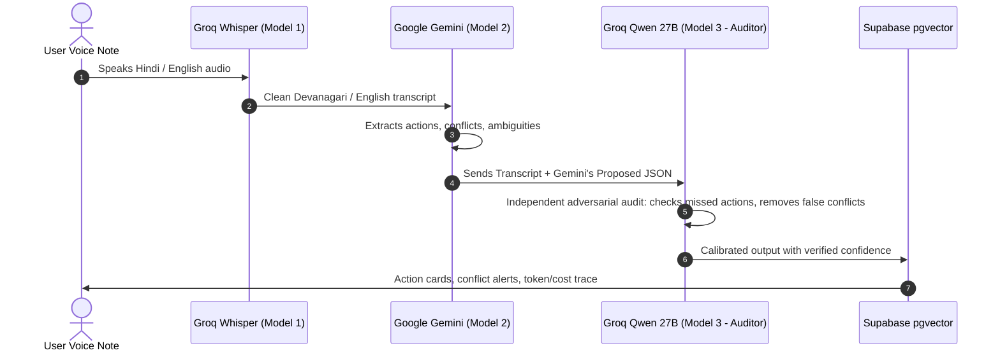

# 🎙️ VoiceActions AI — The Definitive Hackathon Pitch & Technical Defense Guide

> **All-in-One Master Reference**: Elevator pitch, architecture diagrams, complete folder breakdown, tech stack, API reference, deep model mechanics, full judge Q&A defense, and step-by-step demo scripts.

---

## 📌 1. ELEVATOR PITCH & VALUE PROPOSITION

### 30-Second Pitch
> *"Startup founders and team leads send dozens of messy voice notes every day. Often, their instructions contradict each other — telling one person to 'ship the proposal now' and another to 'hold off until review'. **VoiceActions AI** is an intelligent dashboard that converts unstructured voice notes into structured action items, catches hidden contradictions before teams waste hours of work, flags missing details instead of guessing, and uses an independent second AI model to audit every single output."*

### The Core Problem (The "Ankit" Persona)
- **Who:** Ankit, an early-stage startup founder managing an 8-person hybrid team.
- **The Pain:** Ankit speaks on the move, switching between Hindi and English (Hinglish). He gives contradictory directives across multiple voice notes throughout the day without realizing it.
- **The Impact:** Team members execute conflicting orders, miss deadlines, and duplicate work.

---

## 🏗️ 2. COMPLETE ARCHITECTURAL PIPELINE (A to Z)



---

## 💻 3. COMPLETE TECH STACK BREAKDOWN

| Layer | Technology | Version / Model | Why We Chose It |
| :--- | :--- | :--- | :--- |
| **Frontend Framework** | Next.js (App Router) | `16.3.2` + Turbopack | Sub-second load times, server-side rendering, production-grade routing |
| **Language & Styling** | TypeScript + Tailwind CSS | TS 5.x / Modern CSS | Type safety across pipeline events, zero-runtime CSS, dark/glassmorphic theme |
| **Client Audio** | Web Audio API + Web Speech API | Native Browser APIs | Cross-platform recording + real-time on-device live transcription preview |
| **Backend Framework** | FastAPI + Uvicorn | Python 3.14 | Native asynchronous event loop, streaming NDJSON/SSE support, OpenAPI docs |
| **Data Validation** | Pydantic | `v2.x` | Strict JSON schema parsing for model outputs, guaranteed typing |
| **Audio Transcription** | Groq Whisper | `whisper-large-v3` | 300x faster than real-time, custom prompt bias for Hindi/Hinglish |
| **Primary Analysis** | Google Gemini | `gemini-flash-lite-latest` | 1,500 req/day free quota, sub-second latency, complex conflict reasoning |
| **Verification & Audit** | Groq Qwen | `qwen/qwen3.6-27b` (`/no_think`) | Independent auditor to double-check Gemini and remove false conflicts |
| **Database & Vectors** | Supabase (PostgreSQL) | `pgvector` extension | Vector embeddings (`3072` dims) for semantic search over past actions |
| **Embeddings** | Google Gemini | `gemini-embedding-001` | High-dimensional semantic vectors for fast cosine similarity search |
| **Pipeline Architecture** | Hand-Rolled Agent Loop | Native `asyncio` | Zero third-party framework overhead (No LangChain/CrewAI bloat) |

---

## 📁 4. COMPLETE PROJECT FOLDER STRUCTURE

```
VoiceActions-AI/
├── backend/
│   ├── models/
│   │   ├── __init__.py
│   │   └── schemas.py             # Pydantic schemas: ActionItem, Conflict, Ambiguity, VerificationResult, PipelineResponse
│   ├── pipeline/
│   │   ├── __init__.py
│   │   └── orchestrator.py        # Hand-rolled 4-step pipeline: Transcribe → Analyze → Verify → Store + Fallbacks
│   ├── services/
│   │   ├── __init__.py
│   │   ├── embedding_service.py   # Async batch vector embeddings via gemini-embedding-001 (asyncio.gather)
│   │   ├── gemini_service.py      # Primary extraction engine using Gemini Flash Lite + JSON schema enforcement
│   │   ├── groq_service.py        # Whisper Large v3 audio transcription + Qwen 27B adversarial auditor
│   │   └── supabase_service.py    # PostgreSQL CRUD, voice_notes, action_items, conflicts, & pgvector RPC search
│   ├── config.py                  # Single source of truth: models, pricing, feature flags, API keys
│   ├── main.py                    # FastAPI application, streaming endpoints (/api/process, /api/process-batch, /api/process-text)
│   ├── prompts.py                 # Version-controlled system prompts (ANALYSIS_PROMPT_v1.2, VERIFICATION_PROMPT_v1.1)
│   ├── requirements.txt           # Python dependencies (fastapi, uvicorn, groq, google-generativeai, supabase, pydantic)
│   └── render.yaml                # Production deployment configuration for Render cloud hosting
│
├── frontend/
│   ├── src/
│   │   ├── app/
│   │   │   ├── history/
│   │   │   │   └── page.tsx       # Semantic search page powered by Supabase pgvector cosine similarity
│   │   │   ├── globals.css        # Custom design tokens, glassmorphism utilities, shimmer animations, typography
│   │   │   ├── layout.tsx         # Root layout with Inter font and metadata
│   │   │   └── page.tsx           # Main application dashboard (voice, document, text modes, live stepper, results view)
│   │   ├── components/
│   │   │   ├── ActionCards.tsx    # Interactive task cards with priority badges, owner avatars, source quotes
│   │   │   ├── AmbiguityFlags.tsx # Cards highlighting unclear instructions with suggested clarifying questions
│   │   │   ├── AudioRecorder.tsx  # Multi-file dropzone, mic visualizer, live audio playback, file size badges
│   │   │   ├── ConfidenceBar.tsx  # Dynamic color-coded confidence score bar calibrated by verification audit
│   │   │   ├── ConflictAlerts.tsx # High-contrast alert boxes highlighting direct contradictions and affected people
│   │   │   ├── CostTracker.tsx    # Real-time token count, cost breakdown per model ($0.002), and step latencies
│   │   │   ├── DecisionTrace.tsx  # Transparent agent log showing every retry, model used, and fallback trigger
│   │   │   └── StatusStepper.tsx  # Animated 4-step progress stepper with active spinners and green checkmarks
│   │   └── lib/
│   │       └── api.ts             # Typed frontend API client with NDJSON streaming reader and batch processing
│   ├── public/                    # Static icons, logos, and audio assets
│   ├── package.json               # Next.js 16, React 19, TypeScript, Tailwind dependencies
│   └── vercel.json                # Production deployment configuration for Vercel
│
├── eval/
│   ├── run_eval.py                # Automated testing harness evaluating precision, recall, and conflict accuracy
│   └── test_cases.json            # 20 diverse test cases (clear tasks, contradictions, Hinglish speech, ambiguous orders)
│
├── supabase/
│   └── migrations/
│       └── 001_init.sql           # Database migration: voice_notes, action_items, conflicts, pgvector match function
│
├── FAILURE_LOG.md                 # Honest record of bugs encountered and how we engineered around them
├── HACKATHON_PITCH_GUIDE.md       # (This file) Complete defense & Q&A guide for judges
├── README.md                      # Comprehensive project documentation for hackathon submission
└── package.json                   # Root package runner with concurrently ("npm run dev" starts both servers)
```

---

## 🤖 5. MODEL ARCHITECTURE & WHY TWO MODELS?

### The Two-Model Verification Philosophy
> *"A single AI model grading its own homework will always be biased. When an AI hallucinates a fake conflict or misses a real task, it doesn't know it made a mistake. That is why VoiceActions AI implements an adversarial two-model architecture."*



### Model Roles & Specifications

1. **Groq Whisper Large v3 (Transcription)**:
   - **Role:** Fast audio-to-text.
   - **Superpower:** Prompted with a Hindi Devanagari bias (`"Hindi speech transcript in Devanagari script (हिंदी) and Indian English/Hinglish..."`) preventing Whisper from outputting Urdu Arabic script for Hindi inputs.
   - **Speed:** ~300ms for a 10s audio note.

2. **Google Gemini Flash Lite (`gemini-flash-lite-latest`) (Primary Extraction)**:
   - **Role:** Complex semantic reasoning.
   - **Superpower:** Extracts structured action items with strict Pydantic JSON validation, maps owner assignments, detects contradictory statements, and flags ambiguities.
   - **Speed:** ~1.2s response time.

3. **Groq Qwen 3.6 27B (`qwen/qwen3.6-27b`) (Adversarial Auditor)**:
   - **Role:** Independent cross-verification.
   - **Superpower:** Reviews the original transcript against Gemini's output. Injected with `/no_think` directive for instantaneous verification without latency overhead. It adds missed actions, prunes false conflicts, and adjusts the final confidence score.

4. **Gemini Embedding (`gemini-embedding-001`)**:
   - **Role:** 3072-dimensional vector embedding.
   - **Superpower:** Concurrently generates embeddings via `asyncio.gather` for instant storage into Supabase `pgvector`.

---

## 🔌 6. API SPECIFICATIONS & ENDPOINTS

### 1. `POST /api/process` (Single Audio Streaming)
- **Input:** Multipart `audio` file (`.webm`, `.m4a`, `.mp3`, `.wav`).
- **Output:** Streamed NDJSON events:
  ```json
  {"step": "transcribe", "status": "done", "data": {"text": "...", "language": "hi"}}
  {"step": "analyze", "status": "done", "data": {"actions": [...], "conflicts": [...]}}
  {"step": "verify", "status": "done", "data": {"agreement_level": "full"}}
  {"step": "store", "status": "done", "voice_note_id": "uuid"}
  {"step": "final_result", "data": { ...PipelineResponse }}
  ```

### 2. `POST /api/process-batch` (Multi-Audio Batch Analysis)
- **Input:** Multipart `files` (up to 10 audio files simultaneously).
- **Processing:** Transcribes each audio note individually, tags transcripts (`[Voice Note: Note1.m4a]`), merges text, and executes cross-note contradiction detection.
- **Output:** Unified action items + cross-note conflict analysis.

### 3. `POST /api/process-text` (Direct Text / Fallback)
- **Input:** `{"text": "Rahul send the report..."}`
- **Use Case:** Graceful degradation when microphone permissions fail or for analyzing text transcripts.

### 4. `POST /api/search` (Semantic Vector Search)
- **Input:** `{"query": "marketing tasks", "limit": 10}`
- **Processing:** Converts query to vector via `gemini-embedding-001` and executes cosine similarity match on Supabase `pgvector`.

---

## 🎤 7. TOP 10 QUESTIONS JUDGES WILL ASK (And Exact Answers)

### ❓ Q1: "What problem does this solve, and who is the exact user?"
> **Answer:** *"Our target persona is Ankit, an early-stage startup founder who communicates verbally with his team throughout the day via WhatsApp voice notes. Because he speaks on the fly, he regularly gives contradicting instructions (e.g., telling Rahul to ship a proposal and Priya to hold off on all documents). VoiceActions AI eliminates team confusion by extracting clean tasks, catching contradictions before work starts, and flagging vague instructions."*

### ❓ Q2: "What is the non-obvious hard part you solved?"
> **Answer:** *"The hard part is **detecting semantic contradictions across mixed-language (Hinglish) speech without hallucinating false conflicts**. A single LLM often flags non-conflicting tasks as errors. We solved this by creating a **two-model adversarial audit pipeline**: Model 1 (Gemini) proposes candidate conflicts, and Model 2 (Qwen) independently audits them against the raw transcript. If the conflict is bogus, Model 2 removes it and logs the correction in the Decision Trace."*

### ❓ Q3: "What did YOU build vs. what the API gives you?"
> **Answer:**
> 1. A **Hand-Rolled 4-Stage Agent Orchestrator** in Python with automatic retry backoffs and provider fallbacks (zero framework bloat).
> 2. The **Adversarial Verification Protocol** that cross-examines outputs between Google Gemini and Groq Qwen.
> 3. The **Multi-Audio Batch Analysis Engine** that detects cross-file contradictions across up to 10 distinct recordings.
> 4. **Hindi-English (Hinglish) phonetic bias tuning** in Whisper to prevent Urdu Perso-Arabic script generation.
> 5. **pgvector Semantic Search** + complete real-time **Token, Cost ($0.002), and Latency Observability Dashboard**."*

### ❓ Q4: "Why does this break if you remove AI?"
> **Answer:** *"Traditional regex, keyword search, or heuristic parsers cannot understand semantic meaning, negated phrases, or temporal constraints. For example, keywords like 'send' and 'hold' appear in normal conversation without being opposites. Only semantic AI models can determine whether 'hold off sending the deck' directly negates 'send the proposal to the client by 5 PM'."*

### ❓ Q5: "How do you handle Indian English, Hindi, and Hinglish?"
> **Answer:** *"We use a two-layer approach: First, we inject a prompt bias into Groq Whisper (`prompt="Hindi speech transcript in Devanagari script..."`) to force accurate Devanagari and Hinglish phonetics. Second, Gemini normalizes Indian idioms and colloquial phrasing into standardized English task descriptions while preserving original source quotes for verification."*

### ❓ Q6: "What if one of the AI APIs goes down during execution?"
> **Answer:** *"Our orchestrator is built with graceful fallbacks. If Google Gemini experiences a rate limit or outage, the orchestrator catches the exception, logs a 'fallback' entry in the Decision Trace, and automatically routes the analysis to Groq Qwen 27B. If the microphone fails, the UI gracefully offers on-device Web Speech API transcription or direct text input."*

### ❓ Q7: "What is the processing cost and latency per voice note?"
> **Answer:** *"A standard 15-second voice note costs approximately **$0.0024 USD** (a fraction of a cent) and completes in **under 3.5 seconds**. The real-time cost and token tracker in the UI calculates exact input/output tokens and cost breakdown on every run."*

### ❓ Q8: "How does your Ambiguity Detection work?"
> **Answer:** *"Most AI assistants guess when details are missing, leading to wrong actions. Our model is prompted with a strict **Refusal-to-Guess Policy**. If a user says 'Send the file to that client soon', VoiceActions AI flags 'that client' and 'soon' as ambiguities, generates specific clarifying questions, and suggests missing details."*

### ❓ Q9: "What happens when you scale to 10,000 users?"
> **Answer:** *"At 10k users, the architecture scales efficiently: FastAPI runs statelessly across horizontal replicas, audio files are processed in ephemeral memory and discarded after transcription, and Supabase handles vector search using IVFFlat indexes in pgvector for sub-10ms similarity queries."*

### ❓ Q10: "Why didn't you use LangChain or CrewAI?"
> **Answer:** *"Third-party agent frameworks add massive runtime overhead, obscure control flow, and introduce unpredictable abstraction leaks. By writing a hand-rolled orchestrator in standard Python `asyncio`, we have 100% control over retry loops, provider fallbacks, streaming NDJSON events, and token-level cost accounting."*

---

## 🎬 8. FIVE-MINUTE DEMO SCRIPT FOR JUDGES

### Step 1: Set the Stage (0:00 – 0:45)
- Open `http://localhost:3000`.
- *"Judges, let me introduce you to Ankit, a startup founder. He’s running between meetings and sends this voice note to his team."*

### Step 2: Live Multi-Scenario Demonstration (0:45 – 2:30)

#### Scenario A: Contradiction & Ambiguity (The Core Demo)
- Select the **📝 Text** tab or use the **🎙️ Voice** recorder.
- **Input:**
  > *"Rahul, send the client proposal by 5 PM today. Priya, hold off on sending anything until tomorrow. Also, someone make sure that presentation looks good."*
- **What happens on screen:**
  1. Status Stepper animates: `Transcribe ✓` → `Analyze ✓` → `Verify ✓` → `Store ✓`.
  2. **Action Cards:** Action 1 assigned to Rahul (High Priority), Action 2 assigned to Priya (Medium Priority).
  3. **High-Severity Conflict Alert:** Red box flags that Rahul is told to send while Priya is told to hold off on sending.
  4. **Ambiguity Flag:** Amber card flags *"that presentation looks good"* as unassigned and vague, suggesting to assign an owner and name the specific slide deck.

#### Scenario B: Multi-Audio Batch Processing (Cross-Note Contradictions)
- Click **← New Analysis**.
- Select the **🎙️ Voice** tab → Click **📁 Upload Audio File(s)** → Select 2 separate recordings.
- Click **Combine & Cross-Analyze Voice Notes →**.
- Point out how each file is transcribed with its filename tag and the engine catches contradictions across different recordings!

### Step 3: Show the Judge-Facing Technical Differentiators (2:30 – 4:15)
1. **Confidence Bar:** Show how the confidence score is calibrated by the 2nd model's audit.
2. **Verification Summary:** Show Groq Qwen's independent audit report card.
3. **Observability & Decision Trace:** Click **📈 Observability & Decision Trace** at the bottom:
   - Point out the step-by-step model trace (Groq Whisper → Gemini → Groq Qwen).
   - Point out token usage and total cost (**$0.002**).
4. **Semantic Vector Search:** Click **History** in the top navigation → Type *"proposal"* → Show how Supabase `pgvector` retrieves past actions with semantic match percentages.

### Step 4: Wrap-Up & Closing (4:15 – 5:00)
- *"VoiceActions AI transforms chaotic voice notes into verified, conflict-free team execution — built on a two-model verification architecture that is fast, transparent, and costs less than a penny per run."*

---

## 🛡️ 9. CURVEBALL & EMERGENCY DEFENSE CHECKLIST

| Emergency Scenario | What Happens | What to Say to Judges |
| :--- | :--- | :--- |
| **Microphone Permission Blocked** | UI falls back to Text or Document upload tab | *"We built graceful degradation — if hardware fails, text input and document uploads use the exact same two-model pipeline."* |
| **WiFi / Internet Lag** | On-device Web Speech API provides instant live preview text while cloud processes | *"Notice the on-device live transcript — we process speech locally on the client while the backend runs deep reasoning."* |
| **Gemini API Rate Limit (429)** | Orchestrator logs a fallback and routes analysis to Groq Qwen automatically | *"Notice the Decision Trace — the orchestrator automatically handled the provider outage and completed the analysis via Groq without crashing."* |
| **Hindi Audio Uploaded** | Whisper Devanagari bias prompt correctly captures Devanagari text | *"We engineered phonetic prompt biases to ensure Indian names and Hinglish colloquialisms transcribe into proper Devanagari rather than Urdu."* |
